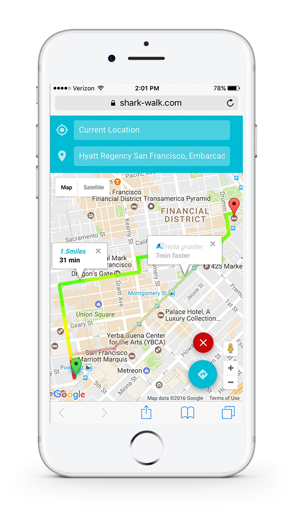
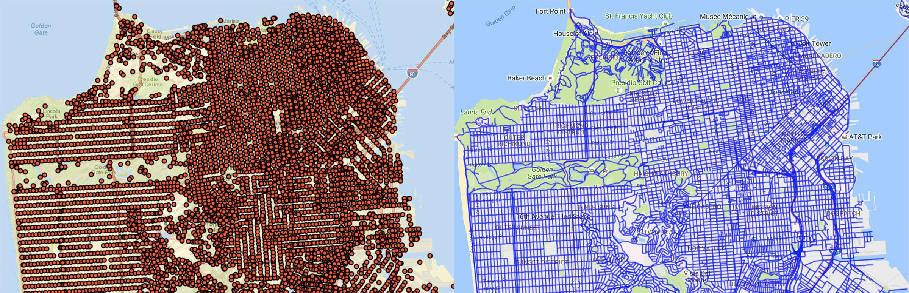
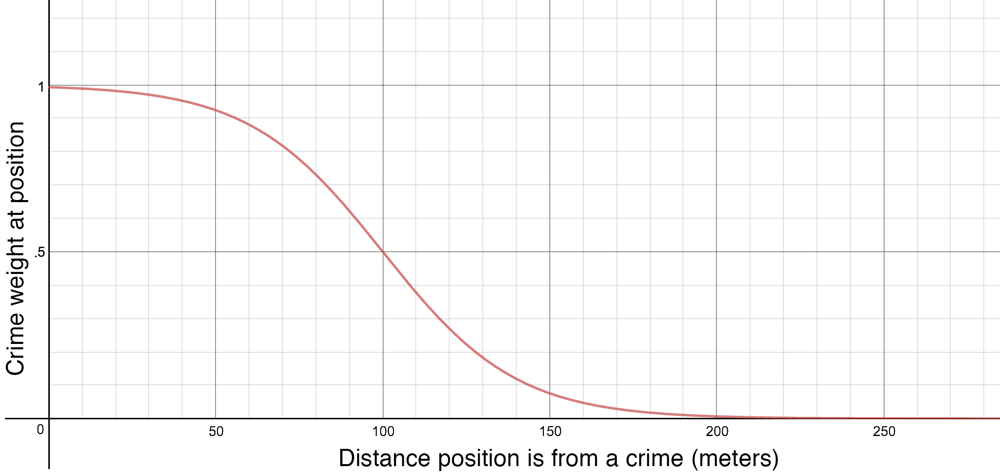
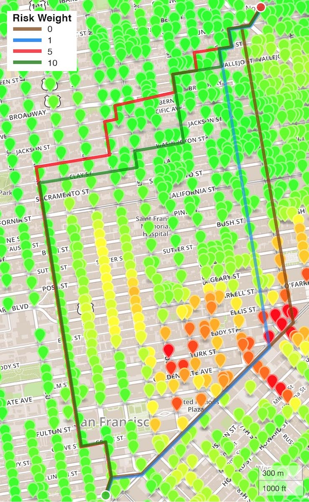

# Shark Walk



> [Shark Walk](https://www.shark-walk.com) is an application that integrates
mapping with crime data to help walkers find a safe path to their destination. Walkers are provided a color gradient line associated with the crime incidence at each location along the path, and a link to walking directions of the chosen route.

## Team

  - [Ker Moua](https://github.com/kmoua92)
  - [David Walsh](https://github.com/rhinodavid)
  - [Mike Stromberg](https://github.com/mjstromberg)
  - [Analisa Heilmann](https://github.com/anaheilmann)

## Table of Contents

1. [Team](#team)
1. [Usage](#usage)
1. [Requirements](#requirements)
1. [Development](#development)
    1. [Installing Dependencies](#installing-dependencies)
    1. [Tasks](#tasks)
    1. [Tech Stack](#techstack)
1. [Data Modeling](#data-modeling)
    1. [Street Graph](#street-graph)
    1. [Crime Risk](#crime-risk)
1. [Diagrams](#diagrams)
    1. [Sequence](#sequence)
    1. [Architecture](#architecture)
1. [Contributing](#contributing)

## Usage

Go to [www.shark-walk.com](http://shark-walk.com) to start using the application.

The application was developed and tested to be used from a mobile device, as well as on a desktop or laptop.

Shark Walk is designed using a service-oriented architecture. To use the app locally for
development, [install the dependencies](#installing-dependencies) for each service.

To set up the Risk Assessment service, first `cd` into the `/riskService` directory.
Ensure the environment variables specified in `.example-env` are set in your environment.
You may do this by manually setting them, or by duplicating `riskService/example.env` to `.env`
and filling in the values there. (Note the service should still work without an API key for the San Francisco
Open Data, as long as the shared quota for requests without a key has not been reached for the
moment. If you don't have an API key, delete `SF_CRIME_APP_TOKEN` and `SF_CRIME_SECRET` from the
`.env` file.) Next, in a separate tab, start MongoDB using the `mongod` command.
To populate the database with crime risk data, run the one-time worker for Downtown San Francisco
by executing `node graphWorker/workerDowntownSFScript.js`. Lastly, start the
service with `npm start`.

To set up the Trip service, open a new tab and `cd` into the `/tripService` directory.
Set the environment variables in `example.env` the same way you did with the Risk Assessment service,
then run `npm start`.

From there, build the React client by `cd`ing into the `/client` directory and running
`npm start`.

The app will now be live at [http://localhost:3000](http://localhost:3000)
in your browser.

## Requirements

- Node 6.7.0

## Development

### Installing Dependencies

Install NPM modules in the **root** directory, then within each service's
folder (`/riskService`, `/tripService`, and `/client`) by executing:

```sh
npm install
```

from within each directory.

### Backlog

View the project backlog [here](https://waffle.io/sharkbox-labs/jellywave)

### Tech Stack

The application was built using the MongoDB, Express, React/Redux, Node (MERN) stack, and incorporates the following technologies:
- [San Francisco Open Data API](https://data.sfgov.org/developers)
- Google Maps API
- Docker

## Data Modeling

### Street Graph



The Shark Walk worker builds a geographic data model by accessing the San Francisco Open Data API's [Street Intersections Dataset](https://data.sfgov.org/Geographic-Locations-and-Boundaries/Street-Intersections/ctsg-7znq) and the [Streets of San Francisco Dataset](https://data.sfgov.org/Geographic-Locations-and-Boundaries/Streets-of-San-Francisco/4ugn-hf48). The worker creates a graph where each intersection is a node and each immediately-connected intersection is an edge. The worker calculates and stores the distance between the node and each edge to speed up pathfinding later down the road.

The Shark Walk worker also uses the [Streets of San Francisco Dataset](https://data.sfgov.org/Geographic-Locations-and-Boundaries/Streets-of-San-Francisco/4ugn-hf48) to create a record of each point in the polylines that describe the city streets. It saves these points, along with the intersections they are connected to, as a secondary graph that is used to find the 'entry' and 'exit' nodes during [pathfinding](#pathfinding).

### Crime Risk



To build a crime risk model, the worker accesses the [SFPD Incidents Dataset](https://data.sfgov.org/Public-Safety/SFPD-Incidents-from-1-January-2003/tmnf-yvry) to retrieve criminal police reports from the last six months. For each node in the street graph, the worker computes a crime risk for that node by examining police reports in the vicinity. The closer a police report is to the node, the more it contributes to the risk at that node. A report that is at the node adds a value of one to the crime risk at the node. The weight of the police report on the crime risk falls off according to the modified sigmoid function shown above. At 100m from the node, a report adds 0.5 to the crime risk weight. At 250m from the node, a police report adds less that 0.001 to the crime risk weight. The worker ignores reports outside of 250m.

## Pathfinding

Armed with a graph of the city's streets and a risk level at each point, Shark Walk is able to develop deterministic optimal paths between two points in the city based on the weight given to the crime risk, or in other words, how far out of one's way one is willing to go to avoid crime risk.

The first task is to compute the 'entry' and 'exit' nodes, which are the first and last nodes on the graph in the journey (this is necessary since the user's origin and destination will not exactly correspond to nodes in the Shark Walk geographic data model). Shark Walk selects the closest point on the street city street to the user's origin and destination from the secondary graph created by the worker. This point is connected to two intersection nodes and one is selected by Shark Walk to be either the entry node (close to the origin) or the exit node (close to the destination).

Once the entry and exit nodes are selected, Shark Walk uses the [A* search algorithm](https://en.wikipedia.org/wiki/A*_search_algorithm) to find a pathway between these points. The cost function for moving between nodes is set as the distance traversed plus the risk traversed times a risk weight. The risk traversed is computed by multiplying the risk level at the next node times the distance to the next node. The A* heuristic is set to be the distance between the node and the destination plus an average risk level throughout the city times the distance times the risk weight.



Increasing the risk weight makes the algorithm search for paths that are longer but encounter less crime risk. As shown in the diagram above, a risk weight of 0 ignores crime risk entirely and generates the path of shortest overall distance. As the risk weight increases, the paths become longer but the risk encountered goes down. At higher risk weights, the path even moves away from the destination momentarily to head down a safer street.

The application uses a risk weight of 1 and 10 to generate routes for the user.

## Diagrams

### Sequence


### Architecture


## Contributing

See [CONTRIBUTING.md](CONTRIBUTING.md) for contribution guidelines.
